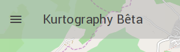
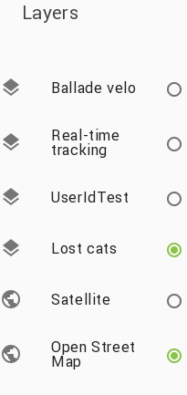
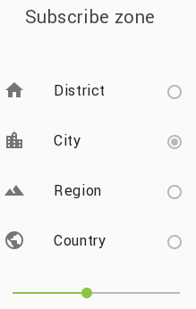
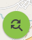
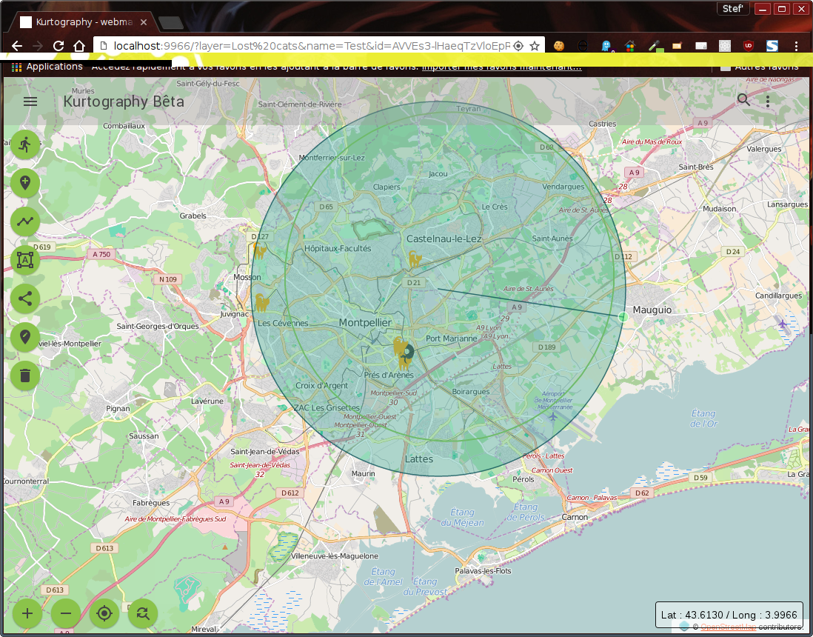

Kurtography
===================

Welcome !! Kurtography is a cartography application based on [Openlayers 3](http://openlayers.org/) and [Kuzzle](http://kuzzle.io) for Kaliop Koding Challenge

### Table of contents


Plugin Status
-------------
Beta stage of development : v. 0.13.0

Requirements
-------------
 - [NodeJS and NPM](https://nodejs.org/en/)
 - [A Kuzzle instance](http://kuzzle.io/guide/), [installation](https://github.com/kuzzleio/kuzzle#installation)
 - If you want to export the datas in geometric format, install [GDAL/OGR Binaries](http://trac.osgeo.org/gdal/wiki/DownloadingGdalBinaries), [ogr2ogr](https://www.npmjs.com/package/ogr2ogr)

Installation
-------------
```
// Clone the repository
git clone git@github.com:HamHamFonFon/kurtography.git kurtography
cd kurtography

// Installation of dependencies
npm install
```


Configuration and Getting started
-------------

#### <i class="icon-upload"></i> Create roles for users
```
node dist/test/roles/createRoleAuth.js
node dist/test/roles/createRoleUser.js
```

#### <i class="icon-upload"></i> Create profiles linked to roles
```
node dist/test/profiles/createProfileUser.js
```
> **Note:** You can add the role "auth" to the profil "admin", so the admin could be login with his kuzzle credentials


If you want to create a testing user, run:
```
In progress...
```

#### <i class="icon-upload"></i> Connexion to kuzzle

Edit file dist\services\config.js and change values of kuzzleUrl and defaultIndex
```
export default {
    kuzzleUrl: 'url_to_kuzzle_instance', // ex : http://localhost:7512
    defaultIndex: 'name_of_your_kuzzle_index'
}
```

#### <i class="icon-upload"></i> Geodatas projection

Edit file dist\services\geo-parameters.js and change value projectionTo. You can specify default coordinates for people who block navigator geolocation
```
export default {
    projectionFrom: 'EPSG:3857',
    projectionTo: 'EPSG:4326'
    latDefault: 48.856614,
    longDefault: 2.352222,
    icons: {
        'collection_name': 'images/path_to_icon.png'
    }
}
```

> **Note:** Don't change "projectionFrom" value, it's the projection using by Openlayers. If you want to record yours datas in Kuzzle with an other projection,
check the [spatial reference list](http://spatialreference.org/ref/epsg/) and edit "projectionTo" value. Default value is 'EPSG:4326' who is the WGS-84 projection (using in GPS, Google Map...)

> **Note 2:** Default coordinates are from Paris, France

> **Note 3:** If you want to attach an icon or an image to a feature (only with type Point), set in "icons" the key/value pair 'collection_name':'images/path_to_icon'

#### <i class="icon-upload"></i> Create compiled files

Files bundle.js and bundle.css must be created with this following commands, by default, they're not exists.

Compile and minify CSS files :
```
npm run build-css
```
A minify CSS will be create in "public/css/"

Run the app with the following command which compile modifications using browserify and babelify :
```
npm run build-map
```
A script bundle.js will be compiled in "public/js/", and after run with
```
npm start
```

Kuzzle Back-Office
-------------

#### <i class="icon-upload"></i> Collections mapping

In Kuzzle-BO, when create a new collection, the mapping must be like (see dist/fixtures/mapping-collection.json) :

```
{
  "properties": {
    "datas": {
      "properties": {
        "location": {
          "type": "geo_point",
          "lat_lon": true
        },
        "type": {
          "type": "string"
        },
        "userId": {
          "type": "string"
        }
      }
    },
    "fields": {
      "properties": {
        "name": {
          "type": "string"
        },
        "date_publish": {
          "type": "date",
          "format": "YYYY-MM-dd"
        },
        "description": {
          "type": "string"
        },
        "url_image": {
          "type": "string"
        }
      }
    }
  }
}
```

Datas :

Item     | type | Information
-------- | -------- | ----------
Location | GeoPoint field | store location in lattitude/longitude (see https://www.elastic.co/guide/en/elasticsearch/reference/current/geo-point.html)
Type | string | Type of feature (point, line, polygone)
UserId | string | Id of user, creator of feature


Fields:

Item     | type | Information
-------- | -------- | ----------
Name | String | Name of your object
Date publish | Date | Date of publish (format YYYY-MM-dd)
Description | string | Description of object
Url image | String | Kuzzle don't store image, but can store an url


#### <i class="icon-upload"></i> Data format
-------------
Datas are recording in [GeoJSON](http://geojson.org/) format in Kuzzle.
Read [Kuzzle documentation](http://kuzzle.io/sdk-documentation/) for more information about KuzzleCollection and KuzzleDocument

Exemple of KuzzleDocument working in Kurtography :
```
/!\ OBSOLETE
{
  "type": "Feature",
  "geometry": {
    "type": "Point",
    "coordinates": [
      3.9609146118164054,
      43.624395670027354
    ]
  },
  "properties": {
    "name": "Test",
  },
  "location": {
    "lon": 3.9609146118164054,
    "lat": 43.624395670027354
  },
  "id": "AVRO9acbPyvkbVrqtBU0",
  "userId": "mySuperUser"
}
/!\ FIN OBSOLETE

{
  "datas": {
    "location": {
        "lon": 3.9609146118164054,
        "lat": 43.624395670027354
    },
    "type": {
        "Point"
    },
    "userId": {
        "mySuperUser"
    }
  }
  "fields": {
    "name": "Test",
    "description": "Test description",
    "date_publish": {
    },
    "url_image": "http://url-to-my-image.com/my-image.png"
  },
  "id": "AVRO9acbPyvkbVrqtBU0"
}
```

Item     | Value | Information
-------- | -------- | ----------


How to : user documentation
-------------

The selection of the layer and the subscribe room is set on the left sidebar : click to left-top button :


#### <i class="icon-upload"></i> Select layer
-------------
List of collections in kuzzle are represented as geographical layers. Select one and documents will be visible.


#### <i class="icon-upload"></i> Subscribtion room
-------------
There are two ways to create a subscribe room :
 - Based on geolocation : a zone with a default radius of 5 km is created. The radius could be changed on the left sidebar.
4 differents scales are predefined : district, city, region and country. You can adjust the radius with the scale line under the option scales



 - Manually : the user can specifiate his own subscribe room with the button "Redraw subscribe zone" in the bottom.
 
 After click, the user can draw a circle
 

#### <i class="icon-upload"></i> Connexion / authentification
-------------
To create, edit or delete kuzzle documents, an account in kuzzle is required. I've create a testing account : kuzzleteam / kuzzle
Click on the needed link.

#### <i class="icon-upload"></i> Add/edit/delete datas
-------------
When the user is connected, a new panel with many buttons appears on left-side : it's the drawing-control panel.

Icon     | Description
-------- | --------
 | Start a tracking feature in real-time based on geolocation (experimental)
 | Add a point on the map
 | Draw a line
 | Draw a square
 | Draw a polygon
 | Exit drawing mode
 | Edit a selected feature
 | Delete a selected feature
 | Exit edit/delete mode


Features
-------------
  - Loading collections as layers
  - Show features from the selected layers
  - Select a projection in EPSG format
  - Create, edit and delete features with an [openlayers3 draw control plugin](https://github.com/HamHamFonFon/ol3-drawButtons)
  - Create and edit properties
  - Create a reference point (for polygons an lines, the reference point is the centroid) for the subscribe room
  - Edit subscribe zone by changing radius
  - Subscribe room : zone from geolocation with 5km radius
  - Search items in subscribe area
  - Get default location if user blocking naviogator geolocation
  - Graphic refactoring with Material Design Lite
  - Reset map to geolocation position
  - Change subscribe zone by geolocalisation
  - Change subscribe zone and search by manual tool
  - Share on social network
  - zoom to document by URL : http://my_site/?layer=kuzzle_collection&name=kuzzle_doc_name&id=kuzzle_doc_id
  - Register user
  - Authentification
  - Filtering features by user for edit and delete

Features in progress
-------------
  - Export datas (need ogr2ogr)
  - Tracking position in real time

Features will be avalaible soon:
-------------
  - User can subscribe to a specific item

Author(s)
-------------
Stéphane MÉAUDRE
 <stephane.meaudre@gmail.com> <smeaudre@kaliop.com>

Licence
-------------
MIT Licence - 2016

See also
-------------
My OpenLayers drawing control plugins : https://github.com/HamHamFonFon/ol3-drawButtons

README.md edited by [StackEdit](https://stackedit.io)
